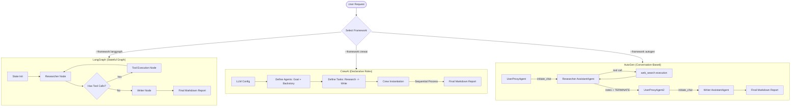

# Comparing Agent Frameworks using Claude

This project provides a clean, side-by-side comparison of three major approaches for building multi-agent systems with **Anthropic Claude**.

Each framework is the natural implementation home for a family of agentic patterns — making this comparison the foundation for a follow-up post on single-agent and multi-agent pattern architectures.

| Framework | Paradigm | Agentic Patterns It Enables |
| :--- | :--- | :--- |
| **LangGraph** | Stateful graph | ReAct, Plan-and-Execute, ReWOO, Reflexion, DAG topologies |
| **CrewAI** | Declarative roles | Hierarchical Agent pattern |
| **AutoGen** | Conversation-based | Peer-to-peer Network, Consensus/Joint, Human-in-the-loop |

---

## 📊 Overview of the Architectures

Each framework implements the same two-agent task:
- **Research Agent**: Uses a DuckDuckGo web search tool to gather facts and compile structured notes.
- **Writer Agent**: Consumes the research notes and drafts a technical report in Markdown.



---

## ⚡ Framework Comparison Matrix

| Feature | LangGraph | CrewAI | AutoGen |
| :--- | :--- | :--- | :--- |
| **Control Flow** | Declarative graph (nodes, edges, state transitions) | Declarative sequential / hierarchical task pipeline | Conversation-based (agents exchange messages) |
| **State Management** | Strongly-typed central state schema (`TypedDict` + reducers) | Implicit task context passing between agents | Shared conversation history (message list) |
| **Cyclic Loops** | Native (edges looping back to nodes) | Implicit via agent thought loops | Native via multi-turn `initiate_chat` |
| **Developer Overhead** | Medium-High — requires understanding graphs, channels, reducers | Medium — requires defining agents, goals, backstory, tasks | Medium — requires understanding agent roles, proxy pattern, termination logic |
| **Customizability** | Maximum — fine-grained control over graph execution and state | Moderate — constrained to Crew-Task abstraction | High — flexible conversation patterns, custom reply functions |
| **Best Used For** | Single-agent patterns (ReAct, Reflexion), DAG pipelines, human-in-the-loop | Role-based team simulations, hierarchical agent topologies | Multi-agent collaboration, peer-to-peer patterns, consensus |

---

## 🛠️ Setup Instructions

### 1. Prerequisite
Python 3.10+. Clone the repo and create a virtual environment:
```bash
python -m venv .venv
source .venv/bin/activate
pip install -r requirements.txt
```

### 2. Configure Environment Variables
```bash
cp .env.example .env
```
Open `.env` and add your Anthropic API key:
```env
ANTHROPIC_API_KEY=sk-ant-...
CLAUDE_MODEL=claude-sonnet-4-6
```

---

## 🚀 How to Run

### Run a Specific Framework
```bash
python run.py --framework langgraph --topic "solid-state batteries"
python run.py --framework crewai --topic "quantum computing"
python run.py --framework autogen --topic "nuclear fusion"
```

### Run All Three and Compare Telemetry
```bash
python run.py --framework all --topic "solid-state batteries"
```

This runs all three sequentially and prints a comparison table of execution time and output size.
Output files written to the project root:
- `notes_langgraph.md` & `report_langgraph.md`
- `notes_crewai.md` & `report_crewai.md`
- `notes_autogen.md` & `report_autogen.md`

---

## 📁 Code Structure

- [`shared/tools.py`](shared/tools.py) — DuckDuckGo `web_search()` with a local mock fallback for offline use.
- [`langgraph_agent/agent.py`](langgraph_agent/agent.py) — `StateGraph` with cyclic tool execution and `ChatAnthropic`.
- [`crewai_agent/agent.py`](crewai_agent/agent.py) — Declarative `Agent/Task/Crew` with `Process.sequential`.
- [`autogen_agent/agent.py`](autogen_agent/agent.py) — Two-phase `AssistantAgent` + `UserProxyAgent` conversation pattern.
- [`run.py`](run.py) — CLI orchestrator: runs frameworks, writes output files, prints telemetry table.

---

## 🗺️ What's Next

This comparison is the foundation for a follow-up post that implements and compares **agentic patterns** directly:

**Single-Agent Patterns**
- **ReAct** — Reason + Act loop (tool calls interleaved with reasoning)
- **Plan-and-Execute** — Separate planning phase from execution phase
- **ReWOO** — Reason Without Observation (plan all tool calls upfront)
- **Reflexion** — Self-critique and iterative self-improvement

**Multi-Agent Topologies**
- **Hierarchical** — Orchestrator delegates to specialised sub-agents
- **Acyclic / DAG** — Directed pipeline with no feedback loops
- **Network (Peer-to-peer)** — Agents communicate laterally without a central manager
- **Consensus / Joint** — Multiple agents debate and converge on a shared answer

**Common Tasks Demonstrated**: external API calls, database access, human-in-the-loop approval.
