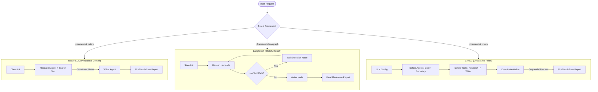

# Comparing Agent Frameworks using Gemini

This project provides a clean, side-by-side comparison of three major approaches for building multi-agent systems with **Google Gemini**:

1. **Native Gemini SDK (`google-genai`)**: Pure Python orchestration using the official Google SDK.
2. **LangGraph (`langgraph`)**: Stateful, cyclic graph orchestration from the LangChain ecosystem.
3. **CrewAI (`crewai`)**: High-level, role-playing, and goal-directed agent orchestration.

---

## 📊 Overview of the Architectures

Each framework is implemented to solve the exact same multi-agent task:
- **Research Agent**: Uses a Web Search tool (DuckDuckGo) to gather facts about a given topic and compiles structured research notes.
- **Writer Agent**: Consumes the research notes and drafts a comprehensive technical report in Markdown.



---

## ⚡ Framework Comparison Matrix

| Feature | Native SDK (`google-genai`) | LangGraph (`langgraph`) | CrewAI (`crewai`) |
| :--- | :--- | :--- | :--- |
| **Control Flow** | Imperative / Standard Python (`if/else`, loops, functions) | Declarative Graphs (Nodes, Edges, State Transitions) | Declarative Sequential / Hierarchical Process (Task pipelines) |
| **State Management** | Standard python variables / structures | Strongly-typed central state schema (State dictionary/Message list) | Implicit task context passing |
| **Cyclic Loops** | Manual loop creation | Native Support (defined by edges looping back to nodes) | Handled implicitly via Agent thought loops |
| **Developer Overhead** | Extremely Low (pure Python, minimal imports) | Medium-High (requires understanding Graphs, Channels, Reducers) | Medium (requires defining Agents, Goals, Backstory, and Tasks) |
| **Customizability** | Maximum (complete control over execution details) | Maximum (fine-grained control over execution graph and state) | Moderate (constrained to the Crew-Task abstraction model) |
| **Best Used For** | Linear workflows, simple agent pipelines, low-latency applications | Complex pipelines, cyclic state-machines, human-in-the-loop workflows | Quick prototype of collaborative team roles |

---

## 🛠️ Setup Instructions

### 1. Prerequisite
Ensure you have **Python 3.10+** (Python 3.11 was installed during workspace setup) and **Homebrew**.

### 2. Configure Environment Variables
Copy the `.env.example` file to `.env`:
```bash
cp .env.example .env
```
Open `.env` and add your **Gemini API Key**:
```env
GEMINI_API_KEY=AIzaSy...
```

---

## 🚀 How to Run the Comparison

Activate the virtual environment:
```bash
source .venv/bin/activate
```

### Run a Specific Framework
To run a single framework (e.g., LangGraph) researching solid-state batteries:
```bash
python run.py --framework langgraph --topic "solid-state batteries"
```

### Run All Frameworks and Compare Telemetry
To run all three implementations sequentially, log their outputs, and view a comparison table of execution speeds and output sizes:
```bash
python run.py --framework all --topic "solid-state batteries"
```

After execution, you will see output markdown files in this directory:
- `report_native.md` & `notes_native.md`
- `report_langgraph.md` & `notes_langgraph.md`
- `report_crewai.md` & `notes_crewai.md`

---

## 📁 Code Structure

- [shared/tools.py](file:///Users/sureshthomas/source/comparing-agent-frameworks/shared/tools.py) - Centralized DuckDuckGo Web Search tool with automatic mock data fallback.
- [native_agent/agent.py](file:///Users/sureshthomas/source/comparing-agent-frameworks/native_agent/agent.py) - Procedural multi-agent pipeline using the official Google Gen AI SDK.
- [langgraph_agent/agent.py](file:///Users/sureshthomas/source/comparing-agent-frameworks/langgraph_agent/agent.py) - StateGraph implementation featuring cyclic tool execution.
- [crewai_agent/agent.py](file:///Users/sureshthomas/source/comparing-agent-frameworks/crewai_agent/agent.py) - Declarative role-playing setup using CrewAI's Agent/Task structure.
- [run.py](file:///Users/sureshthomas/source/comparing-agent-frameworks/run.py) - Command Line orchestrator for running and comparing results.
