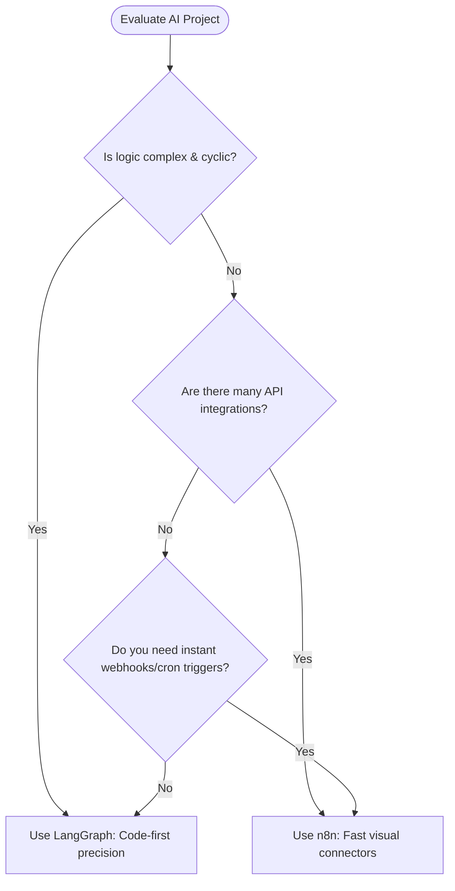

# 📊 LangGraph vs. n8n Orchestration

This document compares **LangGraph** (a code-first stateful agent framework) with **n8n** (a visual, platform-managed workflow automation tool) when building and orchestrating AI agents.

---

## 🏗️ Architectural Differences

| Dimensions | LangGraph (`langgraph`) | n8n (`n8n`) |
| :--- | :--- | :--- |
| **Control Interface** | Code-first (Python or TypeScript) | Visual canvas (Drag-and-drop Nodes) |
| **Runtime Environment** | Embedded within your Python/JS app | Managed platform / Docker container / SaaS |
| **Integrations** | Handled manually via code packages and custom tools | 400+ pre-built third-party API connector nodes |
| **Trigger Mechanism** | Manual invocation, requires custom API servers (FastAPI/Express) | Native webhooks, crons, and event listeners |
| **State Management** | Centralized, typed state graph with reducers and channels | Step-by-step payload passing (JSON schema) |

---

## 🌟 Key Advantages of n8n Beyond Visualization

While both tools allow building multi-agent architectures, n8n provides structural changes to infrastructure management:

### 1. Pre-built Connectors & API Wrappers
* **LangGraph**: You must write python functions or wrappers to fetch or send data to third-party services, handling authentication, headers, and API updates manually.
* **n8n**: Provides drag-and-drop nodes for tools like Slack, Jira, Notion, Postgres, Gmail, and Salesforce. It handles OAuth2 credentials and token refreshes natively.

### 2. Built-in Hosting, Webhooks, and Triggers
* **LangGraph**: To productionize, you need to expose your graph via an API server, set up webhook listeners, or deploy to LangGraph Cloud.
* **n8n**: Functions as a production automation server. It generates webhook endpoints instantly, manages background crons, and schedules tasks out-of-the-box.

### 3. Native Human-in-the-Loop (HITL)
* **LangGraph**: Requires setting up persistence savers (e.g., Postgres checkpointers) and managing custom pause/interrupt graph states in code.
* **n8n**: Features standard **Wait** and **Waiting for Input** nodes. You can pause a running workflow, display a simple visual form to a human, capture their input, and continue execution.

### 4. Telemetry and Retries
* **n8n**: Features a robust execution history panel. You can inspect the exact input/output payloads of every node for past runs, edit variables on the fly, and click **"Retry from this node"** on a failed step.

---

## ⚖️ How to Choose Between LangGraph and n8n

### When to choose LangGraph
* **Fine-grained control flow**: You need specific Python logic, complex memory management, custom schemas, and advanced state machine conditions.
* **Complex Cyclic Loops**: You need a high degree of agent self-reflection and multi-turn loops.
* **Codebase Alignment**: The system must run completely locally, embedded inside your existing backend software, without another server dependency.

### When to choose n8n
* **Rapid API integration**: You need to fetch data from Salesforce, format it, update a Notion document, and notify Slack.
* **Low-code automation**: You want a simple tool-calling agent that is easy for non-developers or operational teams to trace and modify.
* **Built-in triggers**: You want a system triggered automatically by emails, calendar events, or incoming webhooks without writing ingestion routes.
